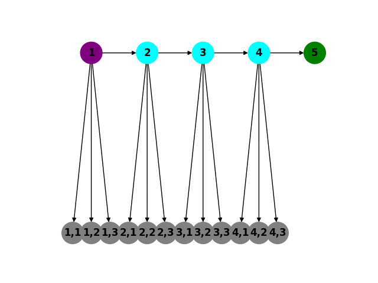

# Cyber Deception

Stage de M2 réalisé de janvier 2024 à juillet 2024. Ce code permet de simuler le comportement d'un attaquant dans une chaîne de microservices où un défenseur pose des leurres pour maximiser le temps que nécessaire à l'attaquant pour arriver à la cible. 

Un notebook est également mis à disposition sur [Google Colab](https://colab.research.google.com/drive/1-yEJ9yJk8F60MYMPic5rrAisjuEh0sWT?usp=sharing) pour tester et manipuler directement le code.

## Modélisation

Cette partie permet de modéliser le graphe ainsi que le comportement de l'attaquant. 

Le fichier **modelling.py** permet de générer le graphe et d'assigner à chaque mircroservice (hormis la cible) un nombre équivalent de leurres. Voici un exemple pour une taille de 5 microservices et pour un total de 12 ressources disponibles à la création d'honeypots:

Pour simuler les déplacements d'un attaquant dans un graphe, nous utilisons **attacker.py**, qui utilise une stratégie uniforme pour se déplacer, et peut retourner au point de départ avec une probabilité qui peut être constante, croissante ou décroissante.

Le fichier **stats.py** permet quant à lui de réaliser des calculs statistiques à partir des simulations d'attaques.

**gurobi.py** et **scipy_optimize.py** sont utilisés pour réaliser des calculs d'optimisations.

